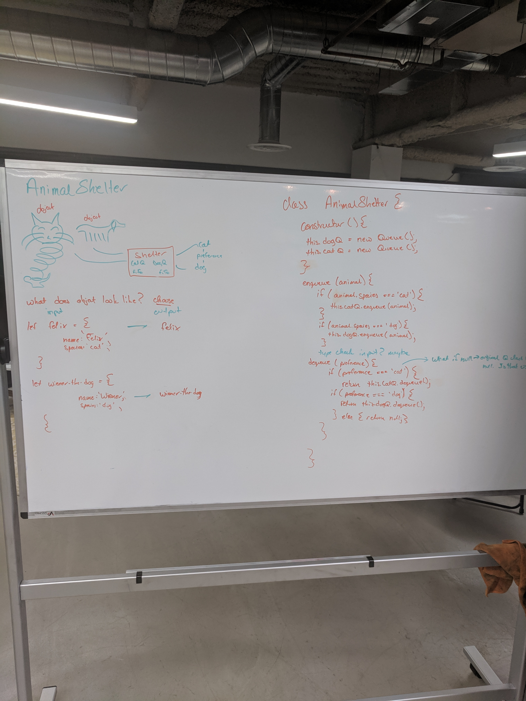

# FIFO Animal Shelter
[PR](https://github.com/alvian-401-advanced-javascript/data-structures-and-algorithms/pull/17)  

## Challenge
* Create a class called `AnimalShelter` which holds only dogs and cats. The shelter operates using a first-in, first-out approach.
* Implement the following methods:
  * `enqueue(animal)`: adds `animal` to the shelter. `animal` can be either a dog or a cat object.
  * `dequeue(pref)`: returns either a `dog` or a `cat`. If pref is not "dog" or "cat" then return `null`.

## Solution

