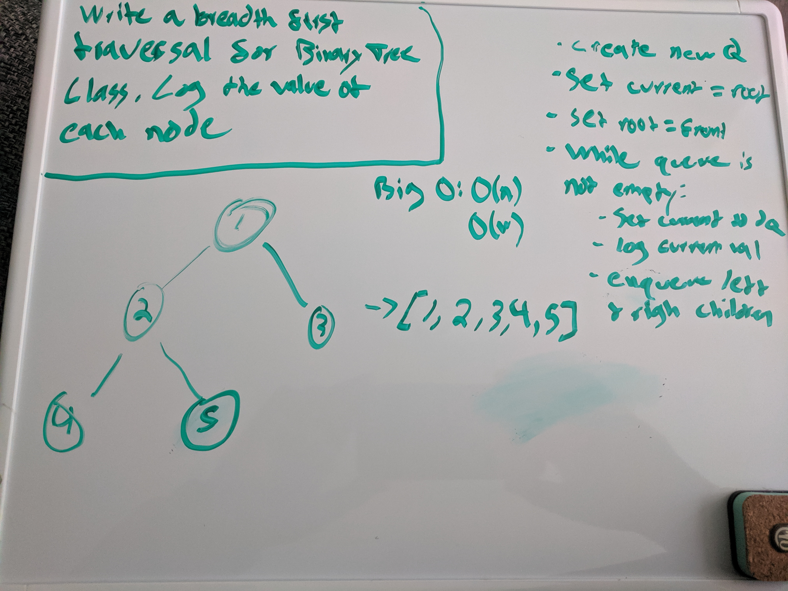

# DSA Implementation - Trees
[PR](https://github.com/alvian-401-advanced-javascript/data-structures-and-algorithms/pull/18)  

## Features
* Create a Node class that has properties for the value stored in the node, the left child node, and the right child node.
* Create a BinaryTree class
* Define a method for each of the depth first traversals called preOrder, inOrder, and postOrder which returns an array of the values, ordered appropriately.
* At no time should an exception or stack trace be shown to the end user. Catch and handle any such exceptions and return a printed value or operation which cleanly represents the state and either stops execution cleanly, or provides the user with clear direction and output.

* Create a BinarySearchTree class
* Define a method named add that accepts a value, and adds a new node with that value in the correct location in the binary search tree.
* Define a method named contains that accepts a value, and returns a boolean indicating whether or not the value is in the tree at least once.

# Breadth First
* Write a breadth first traversal method which takes a Binary Tree as its unique input. Without utilizing any of the built-in methods available to your language, traverse the input tree using a Breadth-first approach; print every visited node’s value.

# findMaxVal
* Write a function called find-maximum-value which takes binary tree as its only input. Without utilizing any of the built-in methods available to your language, return the maximum value stored in the tree. You can assume that the values stored in the Binary Tree will be numeric.

## Testing

* Can successfully instantiate an empty tree
* Can successfully instantiate a tree with a single root node
* Can successfully add a left child and right child to a single root node
* Can successfully return a collection from a preorder traversal
* Can successfully return a collection from an inorder traversal
* Can successfully return a collection from a postorder traversal

##Whiteboards

